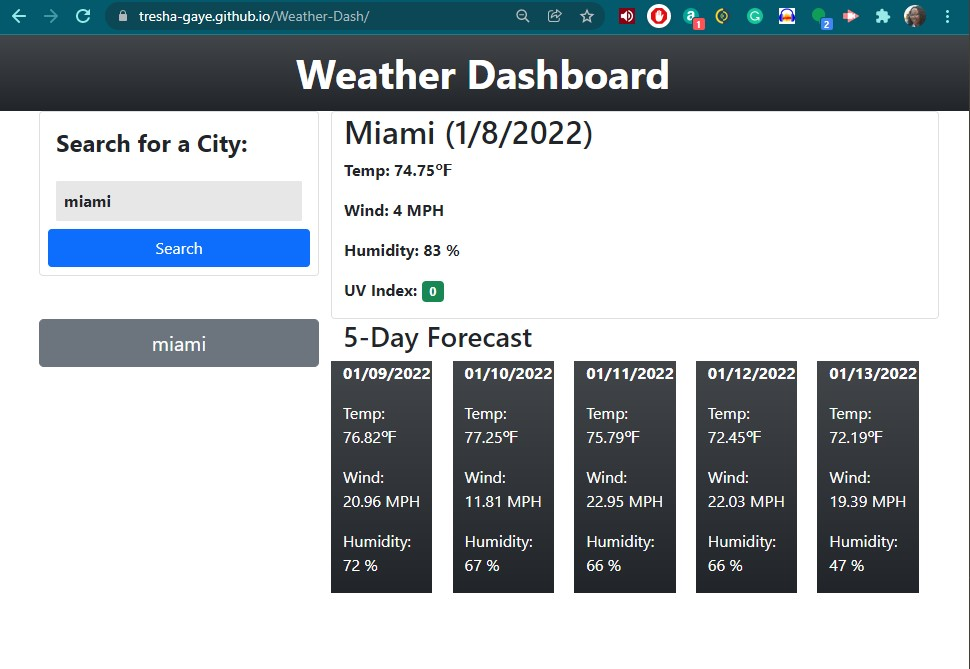

# Weather-Dash

This application uses a server-side API - Open Weather to create a responsive, dynamic Weather Dashboard that will run in the browser and feature dynamically updated HTML and CSS.

View the deployed application by [clicking this link](https://tresha-gaye.github.io/Weather-Dash/).

**Criteria and Accomplishment**

- The app is required to retrieve data from [OpenWeather One Call API](https://openweathermap.org/api/one-call-api) for cities entered by the user, present the date in the browser, and use localStorage to store persistent data. 
- The Weather Dashboard uses form inputs, and allows a user to search multiple cities for current and future weather conditions.

Below is a screenshots of the app showing the functionality:

**Challenges to be addressed in Version 2**
- Weather icons: accessing the weather icons was fairly simple, since the information was available in the data (data.weather[0].icon), but finalizing the script to dynamically show the icons as images on the browser was a little challenging.
- LocalStorage: I was able to get one search input at a time to save to localStorage and to be dynamically presented in the browser, but the data did not persist when the page was refreshed. 
- UV Index badge color: In order to make the uv index data into a badge, I hardcoded the descriptor in order to style the span that was dynamically created with the value (data.current.uvi).

-- adding weather icons: the 
## Contributing

## Credits

**The following resources were used to complete this project:**
1. UCONN Coding Bootcamp's modules on JavaScript/Server-Side API
2. Bootstrap library [Bootstrap] (https://getbootstrap.com/)
3. StackOverflow resources [Stack Overflow] (https://stackoverflow.com/)
4. MDN Web Docs on Fetch API [MDN] (https://developer.mozilla.org/en-US/docs/Web/API/Fetch_API)
5. Momentjs documentation [Moment] (https://momentjs.com/)
6. Open Weather API documentation [OpenWeather] (https://openweathermap.org/api)

## License
[GNU](https://opensource.org/licenses/GPL-3.0)
